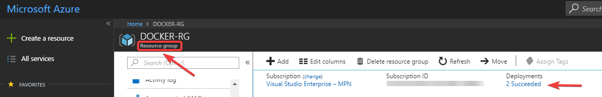
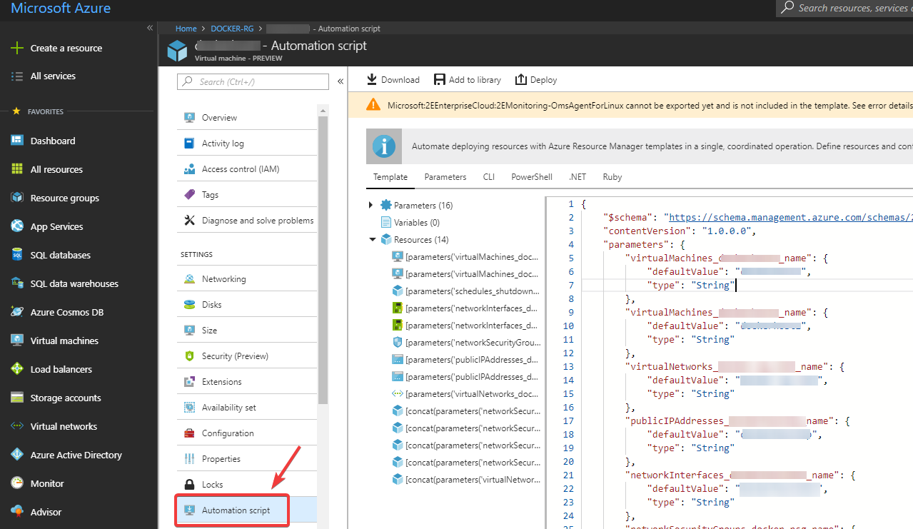
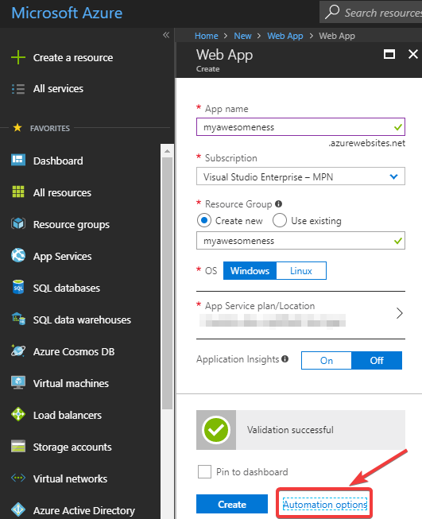

# Appendix

## Additional hands on scenarios to try out
Time to do some stuff on your own and learn by doing...

### Dealing with deployment errors
Take the scripts from the final lesson and apply it with `webAppName = 'My#Web!App'`. What will most likely happen? Yes you get errors. Try to understand the possibilities where you get information about errors.
  Want a hint? 

### Learning from actual resources
Some times it is a good thing to just look how actual Azure infrastructure resources have been deployed and how their JSON looks like. 
Each and every resource should have an `Automation Script` menu entry within the Azure portal. Go find it and take a look... 

To get a view on the script with less clutter just create a new resource within the portal. Before your last step of approving the resource creation you see something like this: 

### Extending deployments by comparing
A template deployment will never be perfect. Things change and so your template will have to change!

Assume you need to extend your JSON for a web app and the web app should be `always on` from now on. What does the JSON look like for this setting?

1. Go to https://ressources.azure.com and logon to your subscription.
2. Find the resource you want to extend and take a look at it's JSON.
3. Logon to your Azure portal and do the change (e.g. the `always on` change).
4. Now check the resource's JSON again and see what has been changed.

This is the JSON you need to put into your template!

## Time to walk alone
Now that you have done your first baby steps in the world be sure to learn to walk by making use of the following resources:

* The official [Azure Resource Manager](https://docs.microsoft.com/en-us/azure/azure-resource-manager/) documentation will guide you through your teenage years with ARM templates.
* Get your hands dirty and learn from real world templates on the [Azure Quickstart Templates](https://azure.microsoft.com/en-us/resources/templates/) website. This is also a very good place to copy resource's example code into your own JSON template.